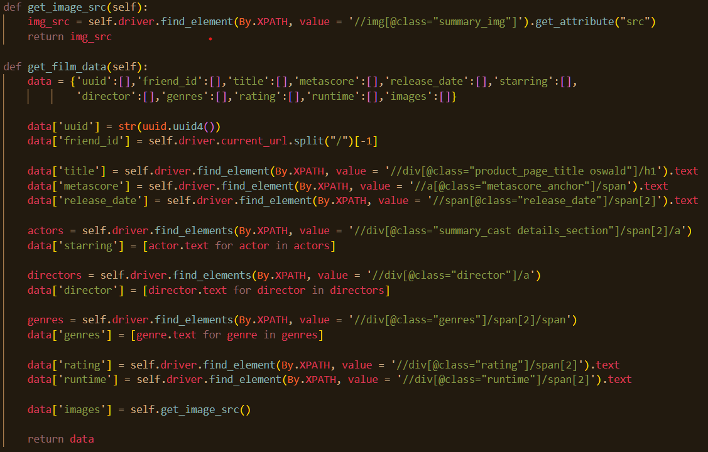
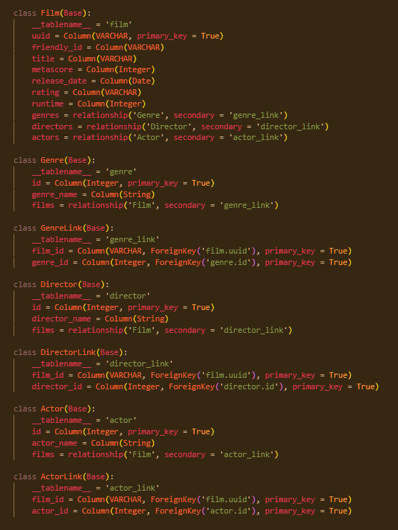
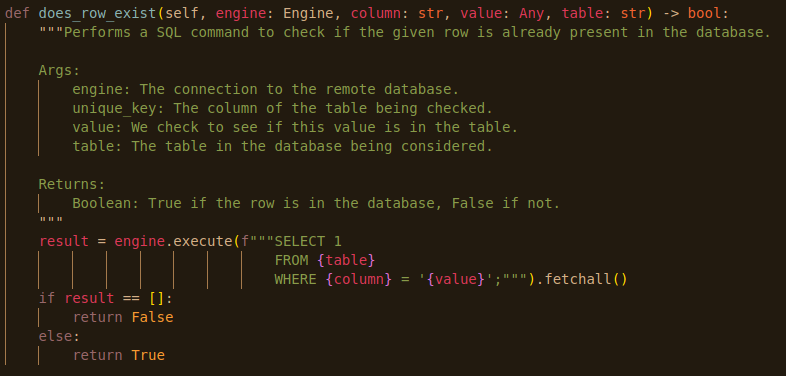

# Data Collection Pipeline project for the AiCore course

## Milestone 1 - Deciding Which Website to Use
- I chose Metacritic as the website I'd be scraping data from. This is because of the wide array of film information it contains.


## Milestone 2 - Prototyping Finding the Individual Page for Each Entry
In this milestone I created the Scraper.py file which contains the Scraper class. This class contains useful methods for performing web scraping:
- The decline_cookies method waits for the Cookies banner to appear and declines the website's cookies request so that execution can continue.
- The get_film_links method finds all of the film links present on the page and returns them in a list object.

I also added the functionality for running the Scraper.py file directly from the command line through the use of 
```python
if __name__ == "__main__"
```


## Milestone 3 - Retrieve Data from Details Page
In this milestone I wrote the code for creating a directory to hold the movie data I wanted,  accessing each of those data points on the webpage, and saving that data.
- Created a dictionary called data to store the various text data like who starred in the film, who directed it, etc.
- Used the built-in selenium methods to access the data points and then stored them in the data dictionary.
```python
directors = self.driver.find_elements(By.XPATH, value = '//div[@class="director"]/a')
data['director'] = [director.text for director in directors]
```
- Used context managers to create the folder raw_data if it doesn't exist, and save the text data to a json file for each film.
- Used a context manager to save the film image to a separate folder called images.



## Milestone 5 - Scalably Storing the Data
This milestone saw me creating methods to save the data I've been scraping to the cloud. By making use of s3 and the AWS RDS services, I was able to save my data dynamically as the data was created.
- Used s3 to save the raw_data dictionary created in milestone 3.
- Used s3 to save the image data.
- Designed a relational data table structure using sqlalchemy and deployed it on the AWS RDS service. (Pictured below).


- There are 3 many-to-many relationships in the database, as a film can have many actors, many directors, and many genres; and vice versa. 
- I also added functionality in this milestone for the user to choose if they'd like to save the scraped data locally (in the raw_data directory) and/or upload the data in tabular form to RDS.


## Milestone 6 - Preventing Re-scraping of Data
In this milestone I implemented functionality to prevent the scraper from re-scraping data from the website. This meant that duplicate data isn't saved to the database.
- Created the does_row_exist method to check the RDS for duplictae data.



## Milestone 7 - Containerising the Scraper and Running it on the Cloud
I containerised the scraper using docker and pushed it to Dockerhub. Then, I was able to create an EC2 instance on AWS and pulled the image from Dockerhub and run it on the EC2 instance.
- Made the scraper run in headless mode, which disables the GUI of the browser.
- Created a Docker image using docker build.
- Pushed the Docker image to Dockerhub using Docker push.
- Created an EC2 instance, connected to it in-terminal using SSH and pulled the Docker image.
- Succesfully ran the scraper from the Docker image on the EC2 instance.


## Milestone 8 - Monitoring and Alerting
Prometheus was set up to monitor the data scraper and also runs on the EC2 instance. Grafana was configured to receive the monitoring data from Prometheus.


